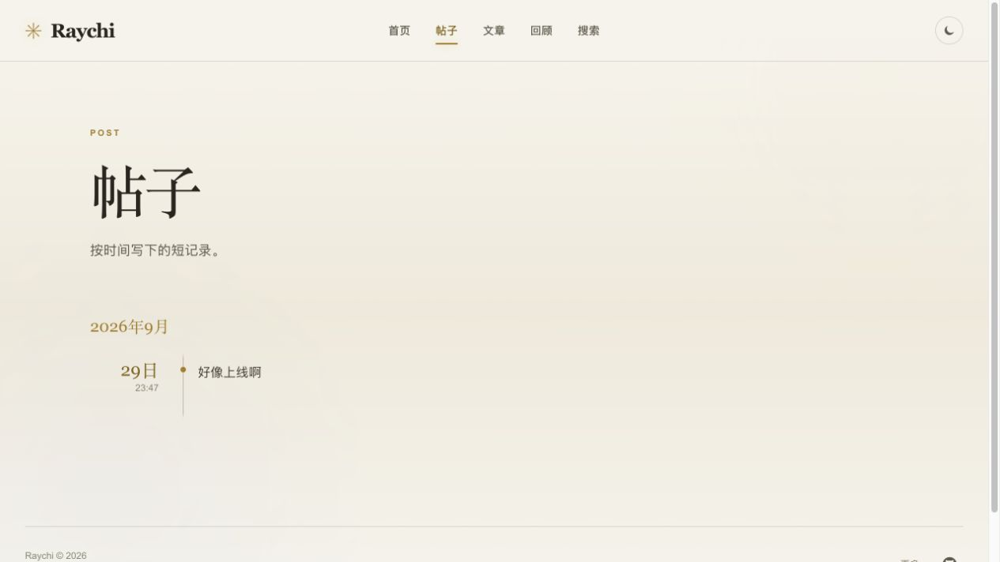
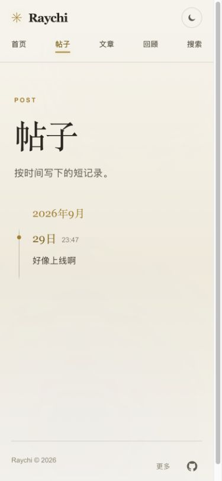

# 帖子正文入口验证 · 2026-10-02

关联 [lantern#13](https://github.com/raychi-space/lantern/issues/13)，承接已合并 PR #12 的公开阅读反馈。

## 版本与检查

- lantern 候选 `56f14959c6c55403012507bac3b7ed174d6e5cb2`，基于 main `8de91a8003e5b187d2a90ad6962997163ddac763`。
- 使用已有本机 wellspring 公开 API，读取现有发布快照；没有服务端/API 或数据库修改。
- Node26.7.0、Next16.3.6；`npm run build`、`npm run typecheck`、`git diff --check` 通过。
- 补充示例由临时 HTTP 服务返回，不写数据库：两个帖子，覆盖有标题/无标题、正文内链接与标签。示例服务转发现有公开设置和分类接口。

## 实际路径

1. 真实帖子时间线不显示“独立链接”。鼠标点击“好像上线啊”正文进入已有帖子详情；详情不包含 `.post-text-link`，没有指向自己的链接。
2. 键盘 Tab 可聚焦无标题帖子的正文详情入口，按 Enter 进入相同详情。入口保持原生 Link，焦点通过正文区域描边表示。
3. 示例帖子正文内的“正文中的文章列表链接”进入 `/writing`；标签进入 `/posts?tag=…` 并显示当前标签，不被正文详情入口截获。标题入口与 Markdown 正文链接是相邻节点，不嵌套 `<a>`。
4. 390×844 真实帖子页面 `innerWidth=390`，文档宽度 375（余下是滚动条），没有横向溢出。点击正文进入同一详情。手机首页最近帖子的原有正文链接同样进入已有详情；首页本来没有额外独立链接，此行为继续保留。测试后重置视口。

正文点击区域只覆盖标题/正文，标签仍独立； hover 使用轻底色，继续保持时间线无包围卡片的样式。

## 截图

本轮没有发布测试内容、调用搜索或调整后端。合并后 main 的真实内容点击复验另附在 Issue #13。
