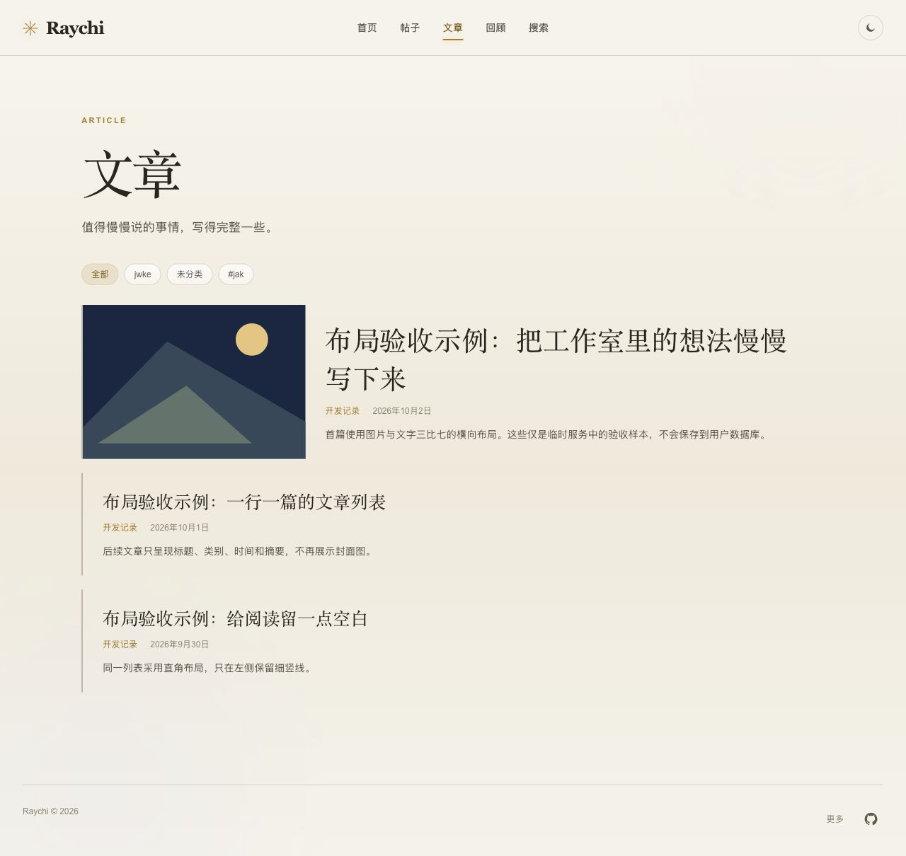
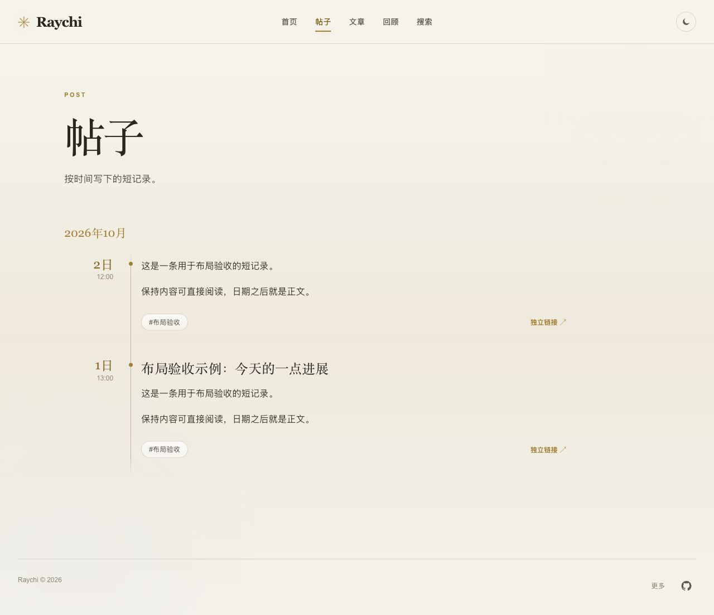
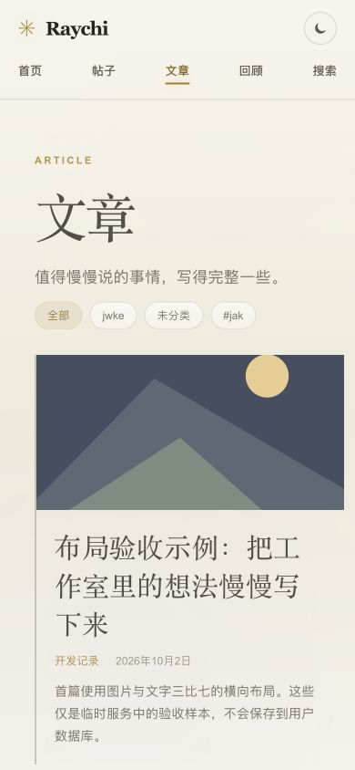

# 公开阅读布局候选验证 · 2026-10-02

关联 [lantern#11](https://github.com/raychi-space/lantern/issues/11)。本轮只修改公开站展示，不改变后端、接口或用户数据。

## 版本与环境

- lantern 实现：`f517fc2b0ba70624a712824abe31e4b6b3d8b1d2`，基于 main `b0c1d0b`。
- wellspring：此前启动的 `81c877e3ffd6d892b7c318c4bf9a527f6a1327b2`，读取现有本机公开 API。
- Node26.7.0、Next16.3.6，`npm run typecheck` 与 `npm run build` 均通过；`git diff --check` 通过。
- 多条布局样本由单独的临时 HTTP 示例服务返回，覆盖 3 篇文章（均携带封面字段）与 2 条帖子，不创建数据库记录。截图中的“布局验收示例”是这些样本。

## 实际结果

| 路径 | 结果 |
| --- | --- |
| 文章单列 | 3 条条目宽度相同、纵向排列；封面节点数量依次为 1、0、0 |
| 首篇比例 | 桌面测得封面占内容宽度 0.2999985，即 3:7；示例图片加载成功 |
| 边框和圆角 | 所有文章条目的上/右/下边框为 0，左边框 2px，圆角 0 |
| 内容顺序 | 标题位于上方，类别/日期随后，摘要最后；整条链接可直接进入对应文章详情 |
| 首页复用 | 精选封面 1 个，后续文本条目 2 条且无封面；最近区块单列布局，配置可见性仍由公开设置决定 |
| 帖子时间线 | 2 条示例帖子，无 `.card` 包围；正文容器边框 0、圆角 0、背景透明，日期点宽 7px；独立链接进入帖子详情 |
| 浅/深主题 | 深色下检查比例与边框，切到浅色后检查完整列表与手机；继续使用主题令牌 |
| 手机适配 | 390×844 视口，首页、文章和帖子文档宽度均为 390，无横向溢出；首篇图上文下，其余无图。测试后重置视口 |
| 真实内容 | 现有 API 各 1 篇文章/帖子；文章封面为空时显示装饰图形，桌面比例 0.2999944；文章条目进入真实详情，帖子时间线无卡片且正文可直接阅读 |
| HTTP | 真实首页、文章、帖子均 200；缺失文章 404 |

## 截图

浅色完整文章列表（示例数据）：

浅色完整帖子时间线（示例数据）：

手机文章（示例数据）：

## 范围与限制

不向用户数据库添加验收文章或帖子。当前真实数据只有一篇文章，后续无图条目和实际图片加载使用临时示例服务验证。过滤参数、分页、详情路由和公开资产转发保持原接口；未重新执行与本轮展示无关的管理发布、撤回或权限回归。

这是候选分支验证。PR 合并后的 main 版本与实际复验结果在关联 Issue 中记录，不将本记录直接当成最终 main 验收。
